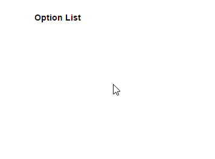

## Input drop down list/menu

This script for binding an drop down list with input area, simple and clean so easy to use with your existing code without cleaning anything.
<br>

<br>
You need to link below script and css to your web page:

```

http://himstar.github.io/input-dropdown-menu-plugin/js/inputDLL.js

and 

http://himstar.github.io/input-dropdown-menu-plugin/css/inputDLL.css

```

You can also clone this repository to extract and use Js and CSS locally.

# Code Explanation:

HTML Structure:

```ruby
<div class="InputDLL">
	<input type="text" id="id1" value="Option List" placeholder="Anything Text">
	<span></span>
	<div class="droplist">
		<a>Option 1</a>
		<a>Option 2</a>
		<a>Option 3</a>
	</div>
</div>

```

Based on JS Object so you need to initiate plugin function with input id:

```ruby
new InputDLL('id1');

```

Support browsers key functions, focus, blur and enter:


```ruby
this.edit.onkeyup = function (e) {
		e = e || window.event;	
		if (e.keyCode == 13) {
			// enter
			if (parobject.visiblecount != 0) {
				var upv = parobject.currentitem.innerHTML;   
				upv = upv .replace(/\<b\>/ig, '');
				upv = upv .replace(/\<\/b\>/ig, '');
				parobject.edit.value = upv;
			};
			parobject.dropdownlist.style.display = 'none';
			e.cancelBubble = true;
      parobject.edit.blur();
			return false;
		}

```
You can makes changes as you need.

